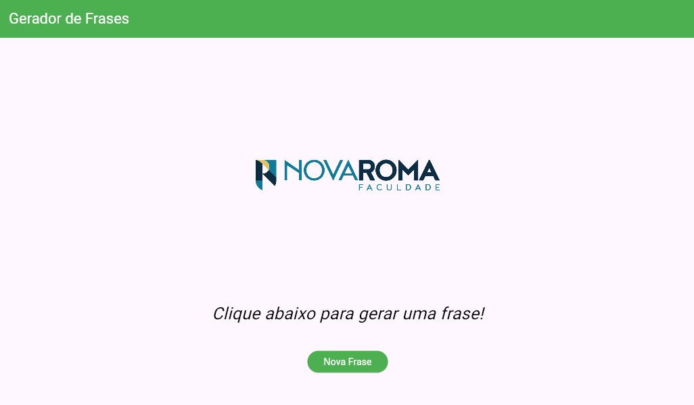

# Gerador de Frases Motivacionais

Este é um projeto Flutter simples que gera frases motivacionais aleatórias ao clicar em um botão. Ele foi desenvolvido para praticar conceitos básicos de Flutter, como widgets, estado e interação com o usuário.

## 📋 Funcionalidades

- Exibe uma frase motivacional aleatória.
- Interface simples e intuitiva.
- Botão para gerar novas frases.
- Exibição de uma imagem centralizada no layout.

## 🛠️ Tecnologias Utilizadas

- **Flutter**: Framework para desenvolvimento de aplicativos multiplataforma.
- **Dart**: Linguagem de programação utilizada pelo Flutter.

## 📂 Estrutura do Projeto

A estrutura principal do projeto é a seguinte:


## 🚀 Como Executar o Projeto

1. Certifique-se de ter o Flutter instalado em sua máquina. Caso não tenha, siga as instruções de instalação no site oficial: [Flutter](https://flutter.dev/docs/get-started/install).
2. Clone este repositório:
   ```bash
   git clone https://github.com/seu-usuario/flutter_newroma.git
3. Navegue até o diretório do projeto:
   ```bash
   cd flutter_newroma
4. Instale as dependências:
   ```bash
   flutter pub get
5. Execute o aplicativo:
   ```bash
   flutter run

##🖼️ Captura de Tela


##✨ Como Funciona

O aplicativo utiliza um array de frases motivacionais e gera uma frase aleatória ao clicar no botão "Nova Frase". A lógica de geração de frases está implementada no método gerarFrase().

## Código Principal

O código principal está localizado no arquivo lib/main.dart:
```bash
void gerarFrase() {
  var numeroAleatorio = Random().nextInt(frases.length);
  setState(() {
    fraseGerada = frases[numeroAleatorio];
  });
}

##📜 Licença

Este projeto é de uso livre e pode ser modificado conforme necessário.

Desenvolvido com ❤️ por Marco Arruda.
